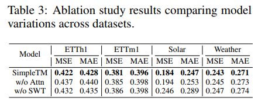
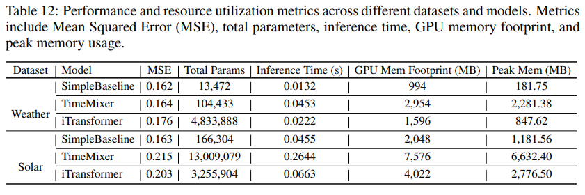

<div align="center">
  <!-- <h1><b> Time-LLM </b></h1> -->
  <!-- <h2><b> Time-LLM </b></h2> -->
  <h2><b> (ICLR'25) SimpleTM: A Simple Baseline For Multivariate Time Series Forcasting </b></h2>
</div>
<div align="center">

<!-- **[<a href="">Paper Page</a>]** -->
<!-- **[<a href="">ICLR Video</a>]** -->

</div>

<!-- # Updates

🚩 **News** (2025.02):

🚩 **News** (2025.03): JAX version released and HuggingFace  -->


## Introduction

We present a simple yet effective architecture - **Waveformer** - that combines classical signal processing with a geometric algebra-enhanced attention mechanism. This lightweight design achieves competitive performance with minimal complexity, matching state-of-the-art baselines across diverse benchmarks.

## Overall Architecture


<p align="center">

</p>


### Module 1: Tokenization via Stationary Wavelet Transform
**Motivational/Rationale**: The first module aims to tokenize MTS data by capturing multi-scale temporal patterns and local/global dependencies across variables. A natural solution is the Wavelet transform, which offers multi-scale decomposition with temporal localization. This approach, inspired by recent use in Transformer models (Yao et al., 2022; Zhu & Soricut, 2024), allows for scale-specific processing. By treating each wavelet scale separately, downstream modules gain access to relevant scale-specific information, improving the efficiency and accuracy of forecasting 
𝑌.

<p align="center">

</p>


**Tokenization via SWT:** The
input series is padded and processed
through learnable filters. SWT inserts zeros between filter coefficients
at each scale, resulting in a nondecimated output. This approach,
shown for scale 2 approximation, allows for shift-invariant feature extraction while preserving the temporal
resolution.
<p align="center">

</p>


### Module 2: A Small Generalization of Self-Attention

**Motivation:** The goal is to capture inter-channel dynamics beyond wavelet-based temporal features. While wavelets encode temporal and frequency information, they miss relationships like channel complementarity or coupling. Large Transformers may learn these implicitly, but smaller models benefit from explicit encoding. The solution is to use the geometric algebra product, which generalizes dot-product self-attention to capture richer dependencies.

<p align="center">
  
</p>

**Figure:** Geometric product objects. (a) shows the oriented parallelogram of the wedge product α ∧ β while (b) shows the progression from scalars to vectors, bivectors, and trivectors.

<p align="center">
  
</p>

**Figure:** A simplified illustration of geometric product attention. The entries of the attention matrix are multi-vectors.


### Module 3: Reconstruction Of Multivariate Time Series
**Motivation/Rationale:** The motivation is to reconstruct the signal in the time domain after processing time-frequency tokens through the geometric product attention module. This is done using a learnable inverse SWT (ISWT) with synthesis filters $h_1$ (low-pass) and $g_1$(high-pass), which correspond to the analysis filters $h_0$ and $g_0$ used in the forward SWT.

<p align="center">

</p>


## Get Started

1. Install requirements. ```pip install -r requirements.txt```
2. Download data. You can download the all datasets from [Kaggle Datasets](https://www.kaggle.com/datasets/wentixiaogege/time-series-dataset). **All the datasets are well pre-processed** and can be used easily.
3. Train the model. We provide the experiment scripts of all benchmarks under the folder `./scripts`. You can reproduce the experiment results by:

```bash
bash ./scripts/multivariate_forecasting/ETT/SimpleBaseline_h1.sh
bash ./scripts/multivariate_forecasting/ECL/SimpleBaseline.sh
bash ./scripts/long_term_forecast/Traffic/SimpleBaseline.sh
bash ./scripts/long_term_forecast/SolarEnergy/SimpleBaseline.sh
bash ./scripts/long_term_forecast/Weather/SimpleBaseline.sh
bash ./scripts/short_term_forecast/M4/SimpleBaseline.sh
bash ./scripts/short_term_forecast/PEMS/SimpleBaseline.sh
```

## Docker

## Main Results
We conduct extensive experiments to evaluate the performance and efficiency of Waveformer, covering long-term and short-term forecasting, including 12 real-world benchmarks and 14 baselines.


### Long-term Forecasting

<p align="center">

</p>

### Short-term Forecasting: Multivariate data

<p align="center">

</p>


## Model Abalations

We conducted an ablation study, including both component replacement (Replace)
and removal (w/o) experiments. Table 3 presents a summary of the results across diverse datasets
and prediction horizons. The findings consistently indicate that geometric attention helps across all
metrics.

<p align="center">

</p>

## Model Efficiency
To provide a thorough efficiency comparison, we evaluated our model against two of the most competitive baselines: the transformer-based iTransformer Liu et al. (2024) and linear-based TimeMixer
Wang et al. (2024). Our experimental setup used a consistent batch size of 256 across all models
and measured four key metrics: total trainable parameters, inference time, GPU memory footprint,
and peak memory usage during the backward pass. Results for all baseline models were compiled
using PyTorch.

<p align="center">

</p>


## Further Reading
1, [**A Simple Baseline For Multivariate Time Series Forcasting**](https://openreview.net/forum?id=oANkBaVci5&referrer=%5BAuthor%20Console%5D(%2Fgroup%3Fid%3DICLR.cc%2F2025%2FConference%2FAuthors%23your-submissions))

**Authors**: Hui Chen*, Viet Luong, Lopamudra Mukherjee, Vikas Singh 

```bibtex
@inproceedings{
chen2025a,
title={A Simple Baseline for Multivariate Time Series Forecasting},
author={Hui Chen and Viet Luong and Lopamudra Mukherjee and Vikas Singh},
booktitle={The Thirteenth International Conference on Learning Representations},
year={2025},
url={https://openreview.net/forum?id=oANkBaVci5}
}
```

## Acknowledgement

We appreciate the following GitHub repos a lot for their valuable code and efforts.
- Time-Series-Library (https://github.com/thuml/Time-Series-Library)
- Autoformer (https://github.com/thuml/Autoformer)
- iTransformer (https://github.com/thuml/iTransformer)
- TimeMixer (https://github.com/kwuking/TimeMixer)

## Contact

If you have any questions or want to use the code, feel free to contact:
* Hui Chen (hchen795@wisc.edu)
* Viet Luong (vhluong@wisc.edu)

